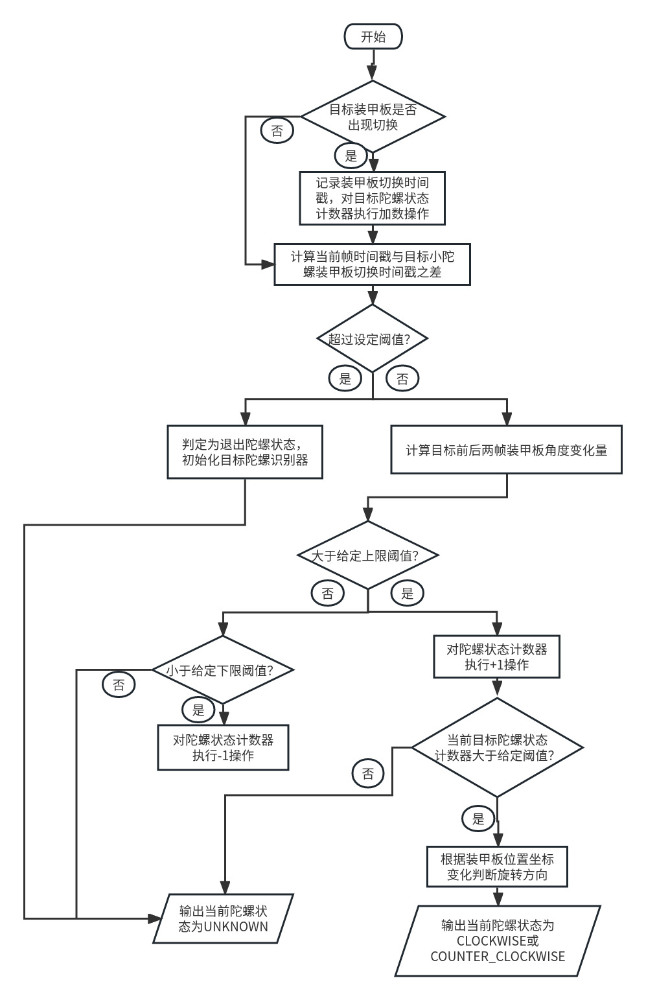

# autoaim
## 1.说明
### Date: 2023-02-02
    1）TODO: 小陀螺状态确定前，存在目标处于小陀螺而程序认定为机动的误判期，这段时间以机动模型对目标做预测会出现预测点落在车体外边的情况（此时云台会很抖）。尝试对预测结果进行评价反馈处理，即记录从当前预测时刻开始到延时预测时刻内的测量值，与预测值进行误差计算，超过某个阈值或误差累积一定次数即认为预测发散，重新初始化预测。
    2）目前对目标小陀螺状态下的旋转周期的求解存在较大的误差，目前的方式是求解目标前后帧的姿态变化，转化为轴角后计算出角速度进而得到周期，但由于姿态本身抖动且帧间变化幅度小，误差或大或小。
    FIXME: 目前进一步处理是求多次的目标旋转周期并取平均值，并预先过滤掉周期异常值，即把周期限定在一定范围。

## 2.数据处理
    预测前考虑对数据误差做处理，首先剔除掉历史队列中的异常值，并通过插值的方式补充，然后再过滤波平滑数据，最后输入模型做预测。

## 3.自动发弹思路
    1）结合目标车辆的血量、距离信息；
    2）结合预测信息；

## 4.自瞄防抖
- Double threshold
- Spinning constraint

## 5.小陀螺
- Detection

    